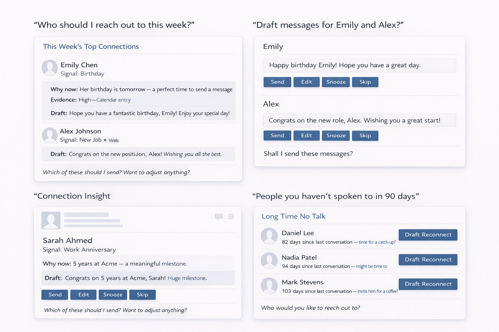

# Improve Relationships

**Become the friend who never misses the moment.**

Improve Relationships is an OpenClaw skill that spots birthdays, milestones, holidays, and reconnect moments — then drafts thoughtful messages for your approval.

It is built for one job: helping you show up for people in a way that feels timely, thoughtful, and natural.



## What it does

Improve Relationships helps OpenClaw:

- spot meaningful moments worth acting on
- rank the strongest opportunities instead of dumping a long list
- separate **work** and **personal** outreach
- suggest the right **channel**, **tone**, and **timing**
- draft messages in the most appropriate language when the evidence is strong
- support culturally relevant moments like **Ramadan**, **Eid**, **New Year**, congratulations, condolences, and check-ins
- require explicit approval before anything is sent

By default, the skill is selective:

- it focuses on **this week**
- separates **work** and **personal**
- shows the **top 5** strongest opportunities first
- includes a short explanation, confidence level, and draft for each

## Quick start

### Install

**Copy into your workspace:**

```bash
cp -r skills/improve-relationships/ ~/.openclaw/workspace/skills/improve-relationships/
```

**Or symlink for active development:**

```bash
ln -s "$(pwd)/skills/improve-relationships" ~/.openclaw/workspace/skills/improve-relationships
```

**Or install from ClawHub:**

```bash
openclaw install improve-relationships
```

### First run

Open OpenClaw and type:

```text
Give me a relationship digest for this week.
```

The skill will ask you about your contacts, scan whatever context you provide, and return a ranked digest with draft messages. Nothing is sent — you review, edit, and send yourself.

### Publishing

If you've forked and improved this skill:

```bash
openclaw publish skills/improve-relationships/
```

## How it works

The skill follows a simple loop:

### detect → score → rank → draft → approve

For each recommendation, it tries to answer:

- why this person
- why now
- why this channel
- why this tone

If it cannot answer those clearly, it downgrades the suggestion or leaves it out of the default digest.

## Usage

### Weekly digest

```text
Give me a relationship digest for this week.
```

Returns up to 5 ranked recommendations grouped by Work and Personal. Each includes the signal, a confidence level, the suggested channel, and a ready-to-send draft. A Watching table shows lower-priority signals. Say "next" for more.

### Birthday and occasion drafting

```text
Draft birthday messages for this week. James's birthday is March 12.
```

Identifies the person, picks the right tone (celebratory for birthdays, ritual for holidays), drafts the message, and presents it for your approval. Works for any occasion — birthdays, Ramadan, Eid, Diwali, Nowruz, promotions, weddings.

### Long silence detection

```text
Find people I haven't talked to in 90 days.
```

Flags contacts you've gone quiet with, ranks them by relationship importance, and suggests reconnect messages. You can provide last-contact dates or let the skill check conversation history.

### Browser tab review

```text
Review this LinkedIn tab and tell me if there's a reason to reconnect.
```

When you share a browser tab — LinkedIn, Instagram, Twitter/X, a company page, a news article — the skill extracts visible signals and scores the reconnection opportunity. It always states what it saw and never claims API access.

### Multilingual drafting

```text
Draft Ramadan check-in messages in Arabic for Amira and Fatima.
```

Drafts in whatever language you and the contact actually communicate in. If your WhatsApp history with Amira is in Arabic, the draft comes in Arabic. Works with any language.

### Work-only or personal-only

```text
Prepare a work-only relationship digest.
```

Filters to a single stream. Work contacts get professional tone and channels (email, LinkedIn). Personal contacts get warmer tone and channels (text, WhatsApp, call).

## Signal types

The skill can work with signals like:

- birthdays
- work anniversaries
- promotions and job changes
- long gaps since last contact
- public accomplishments
- relevant company news
- visible activity from a user-shared browser tab
- congratulations moments
- condolence moments
- ritual and holiday moments
- lightweight reconnect opportunities

## Work and personal stay separate

Improve Relationships is designed to keep context clean.

- **Work** outreach stays professional in tone and channel
- **Personal** outreach stays warmer and more direct
- mixed or unclear contacts are flagged instead of guessed
- work-only context is not used to over-personalize personal outreach
- personal-only context is not used to over-personalize work outreach

Unless you ask for a combined digest, work and personal recommendations are shown separately.

## Multilingual by design

This skill is built for multilingual relationships and mixed-language environments.

It can:

- work with signals that appear in different languages
- preserve important wording from the original source when useful
- draft in a likely shared language when the evidence is strong
- fall back to your default language when it is not
- offer alternatives when language preference is unclear

The goal is not to guess aggressively. It is to make multilingual outreach easier and more natural.

## Privacy and security

Improve Relationships is draft-only and privacy-conscious.

- it only uses context you explicitly provide or make available
- it does not pretend to have access to hidden sources
- it does not auto-send messages
- it labels weak evidence clearly
- it avoids overconfident or invasive outreach
- it treats sensitive situations cautiously
- it keeps drafts proportionate to the evidence and relationship strength

This skill should feel useful, but conservative.

## What it does not do

- it does not send messages automatically
- it does not scrape private platforms
- it does not claim API access it does not have
- it does not act like a sales CRM
- it does not assume religion, culture, or language from weak evidence
- it does not treat weak social hints as confirmed truth

## Customization

### Adding contacts

You can provide contacts in conversation ("James Park's birthday is March 12, he's a close friend") or use the example CSV format in `examples/example_contacts.csv`. The skill picks up whatever context you share.

> **Note:** All names, dates, and details in the example files are entirely fictional and do not represent real individuals.

### Setting preferred channels

Tell the skill how you reach each person: "I usually text James and email Sarah." It remembers within the session and uses that for channel recommendations.

### Language preferences

The skill detects language from your communication history with each contact. You can also set it explicitly: "Amira and I talk in Arabic." If it's unsure, it asks or offers two draft options.

### More or fewer results

The default digest shows 5 recommendations. Say "show me all" or "next" for more. Say "work only" or "personal only" to filter by stream. Say "just the top 1" or "top 3" to narrow it down.

## Repo structure

```text
improve-relationships/
├── skills/improve-relationships/
│   ├── SKILL.md                      The skill — agent-facing instructions
│   ├── templates/
│   │   ├── digest.md                 Weekly/daily digest scaffold
│   │   ├── outreach_personal.md      Personal message patterns
│   │   ├── outreach_professional.md  Professional message patterns
│   │   └── rituals.md                Cultural occasion templates
│   └── examples/
│       ├── example_digest.md         Sample digest output
│       ├── example_signals.json      Sample signal objects
│       └── example_contacts.csv      Sample contact data
├── docs/
│   ├── product-thesis.md             Why this exists
│   ├── roadmap.md                    What comes next
│   └── testing.md                    Test cases and checklist
├── .github/                          CI workflows, issue + PR templates
├── assets/                           Screenshots
├── CHANGELOG.md                      Version history
├── CODE_OF_CONDUCT.md                Community standards
├── CONTRIBUTING.md                   How to contribute
├── SECURITY.md                       Security policy
├── LICENSE                           MIT
└── README.md                         You are here
```

## Contributing

Contributions are welcome. See [CONTRIBUTING.md](CONTRIBUTING.md) for guidelines on how to submit changes, what belongs in this repo, and how to test.

## Roadmap

| Version | Status | Focus |
|---------|--------|-------|
| **v1.0** | Current | Skill — signal detection, scoring, multilingual drafts, privacy model |
| **v1.5** | Planned | Scoring calibration, more cultural templates, compact digest format |
| **v2.0** | Planned | Plugin — persistent state, typed tools, outreach history tracking |
| **v3.0** | Speculative | External signal engine, webhooks, relationship graph |

See [docs/roadmap.md](docs/roadmap.md) for details.

## License

[MIT](LICENSE)

---

[Changelog](CHANGELOG.md) · [Security](SECURITY.md) · [Code of Conduct](CODE_OF_CONDUCT.md) · [Testing Guide](docs/testing.md)
